# Al Afif Abdurrahman Portfolio

Portfolio interaktif untuk Al Afif Abdurrahman yang dibangun dengan React, Vite, Tailwind CSS, `motion`, dan `lucide-react`. Website ini memakai konsep split personality: mode **Profesional** untuk pengalaman IT, skill, project, pendidikan, dan sertifikat teknis; serta mode **Casual** untuk organisasi, public speaking, kepemimpinan, galeri kegiatan, dan sertifikat non-teknis.

## Preview Utama

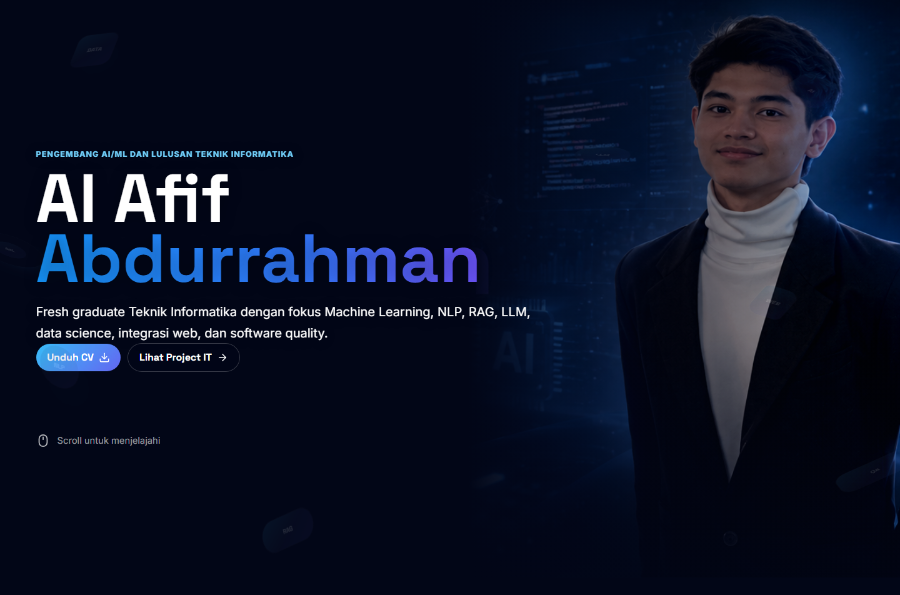

## Cara Menjalankan

```bash
python run.py
```

Runner akan masuk ke folder `frontend`, memasang dependency jika `node_modules` belum tersedia, lalu menjalankan Vite development server.

Perintah frontend:

```bash
cd frontend
npm run dev
npm run build
npm run test -- --run
```

## Struktur Proyek

- `frontend/`: aplikasi portfolio berbasis React, Vite, Tailwind CSS, motion animation, dan komponen UI.
- `frontend/src/components/`: komponen section seperti hero, profil, skill, project, timeline, galeri, sertifikat, kontak, dan footer.
- `frontend/src/data/portfolio.js`: sumber konten utama untuk mode Profesional dan Casual.
- `backend/`: placeholder backend FastAPI-compatible untuk pengembangan berikutnya.
- `foto/`: aset sumber berupa foto, sertifikat, CV, dan dokumen pendukung.
- `docs/screenshots/`: screenshot per section untuk dokumentasi GitHub.

## Analisis Section Keseluruhan

Website memiliki dua mode konten yang dapat diganti lewat tombol toggle di navbar. Beberapa section sama-sama muncul pada kedua mode, tetapi isi dan konteksnya menyesuaikan mode aktif.

## Mode Profesional

### 1. Hero / Beranda

Section pembuka menampilkan nama Al Afif Abdurrahman, peran sebagai pengembang AI/ML dan lulusan Teknik Informatika, ringkasan fokus bidang, tombol unduh CV, dan tombol menuju project IT. Visual hero menggunakan potret profesional sebagai sinyal pertama bahwa halaman ini adalah portfolio personal.


### 2. Profil

Section Profil menjelaskan positioning profesional: fokus pada Machine Learning, NLP, RAG, LLM, data science, integrasi web, software quality, Python, K-Means, CNN, SVM, dan CRISP-DM.

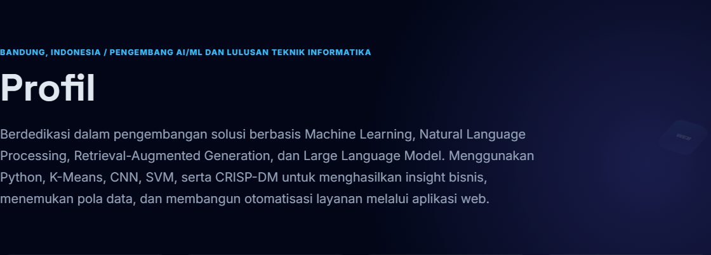

### 3. Sorotan Profil

Highlight strip merangkum metrik cepat yang mudah dipindai: IPK 3,90, fokus AI/ML, target kelulusan 2026, serta pengalaman magang dan pelayanan.

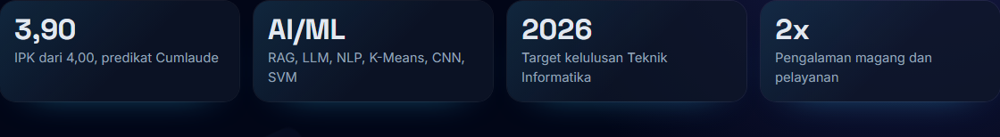

### 4. Tech Stack

Section Tech Stack mengelompokkan kemampuan menjadi kategori teknis seperti bahasa pemrograman, AI dan data, tools workflow, soft skills, dan bahasa. Komponen ini membantu recruiter melihat kemampuan inti secara cepat.

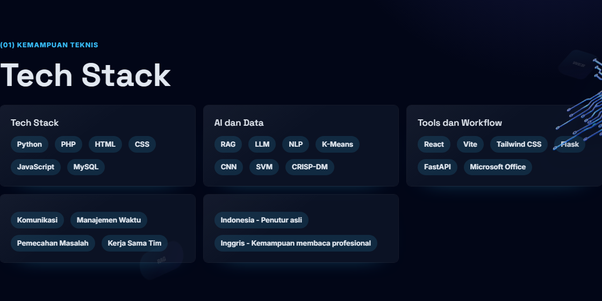

### 5. Project IT

Section Project IT menampilkan project unggulan seperti RAG Chatbot Desa, Segmentasi Pelanggan berbasis K-Means Plus, dan pengalaman Software Quality Assurance. Card project berisi ringkasan, tag teknologi, gambar pratinjau, dan link GitHub bila tersedia.

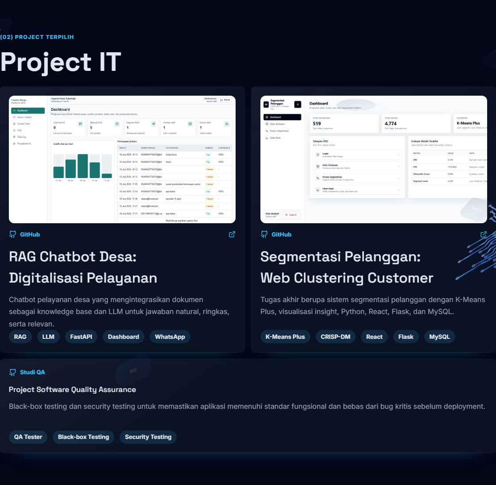

### 6. Pengalaman IT

Timeline Pengalaman IT merangkum pengalaman sebagai IT Support Intern di PT DiAntara Inter Media dan pengalaman pelayanan/operator di Kantor Kecamatan Kertasari.

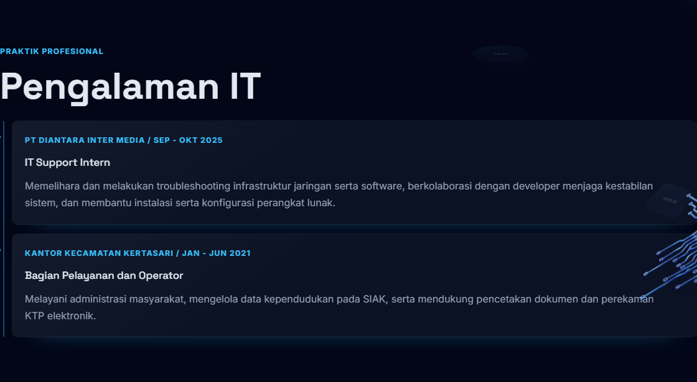

### 7. Pendidikan

Section Pendidikan menampilkan latar S1 Teknik Informatika di Universitas Kebangsaan Republik Indonesia, IPK, fokus akademik, pratinjau transkrip nilai, dan tombol unduh transkrip.

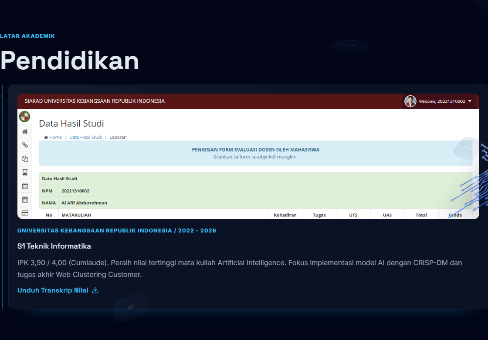

### 8. Sertifikat Profesional

Section Sertifikat pada mode Profesional menampilkan bukti perjalanan teknis seperti bootcamp Data Science & AI, praktik kerja industri, portfolio AI chatbot, Coursera networking, seminar, dan sertifikat terkait AI/software development.

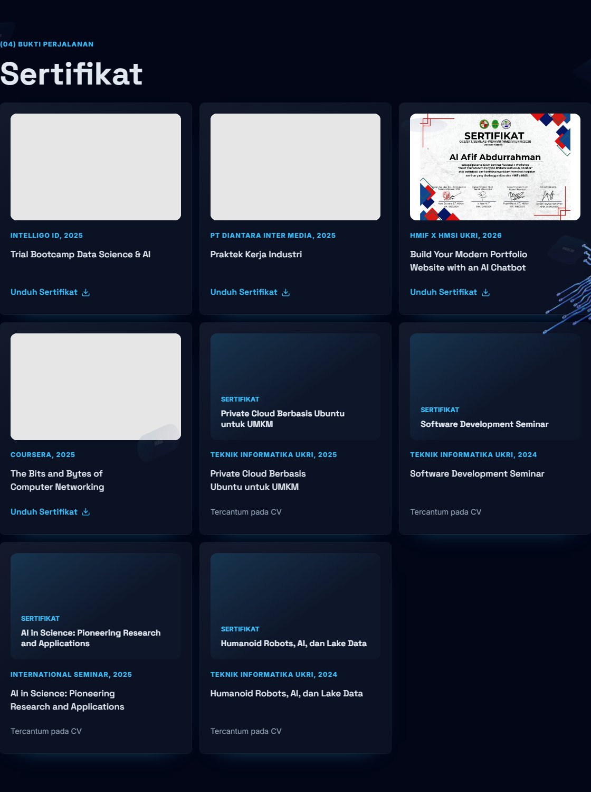

### 9. Kontak

Section Kontak menyediakan akses cepat ke Email, LinkedIn, GitHub, dan WhatsApp. Ini menjadi area konversi utama setelah pengunjung membaca profil dan portfolio.

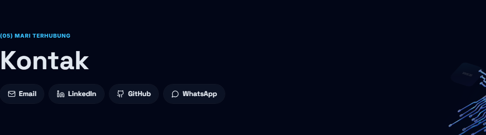

### 10. Footer

Footer berisi ajakan kerja sama, tombol unduh CV, ringkasan mode aktif, link email/GitHub, dan tombol untuk berpindah ke mode Casual.

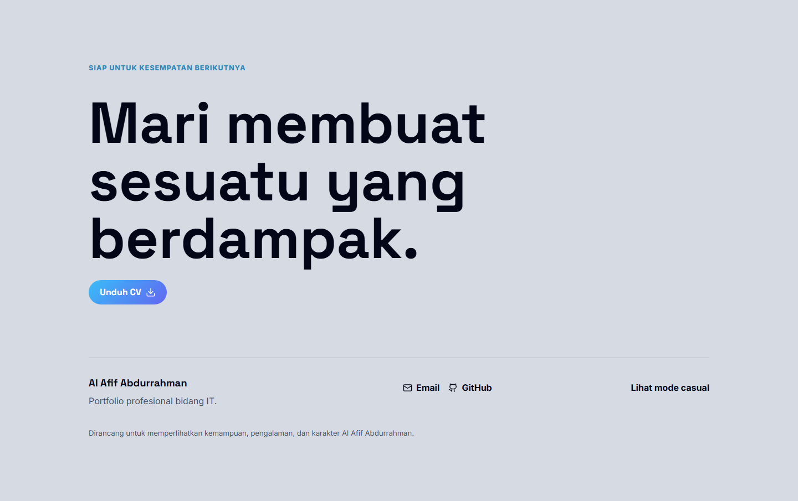

## Mode Casual

### 1. Hero / Beranda Casual

Hero Casual mengubah narasi menjadi sisi organisasi, public speaking, dan performance. CTA kedua mengarah ke galeri, sehingga pengunjung langsung diarahkan ke bukti visual aktivitas non-teknis.

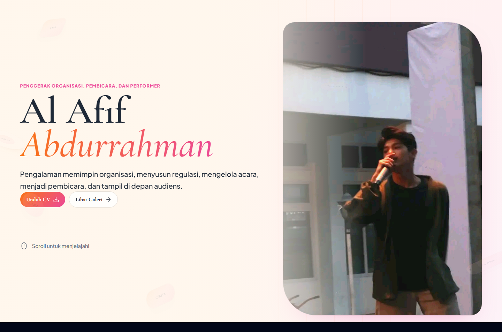

### 2. Profil Casual

Profil Casual menjelaskan kekuatan kepemimpinan, advokasi, public speaking, manajemen acara, dan seni pertunjukan sebagai pelengkap kemampuan teknis.

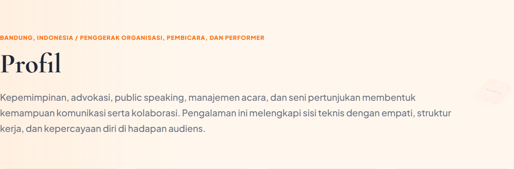

### 3. Sorotan Casual

Highlight Casual menampilkan peran penting seperti DPM, ketua pelaksana IT X FAIR, speaker Voyage of Discovery 2025, dan performer Teater Lima Wajah.

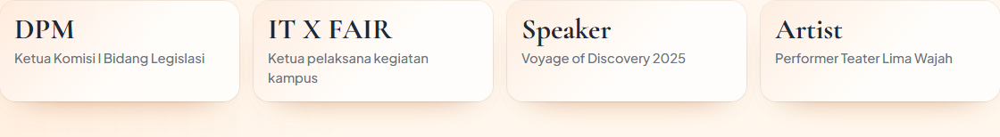

### 4. Organisasi

Timeline Organisasi merangkum kontribusi dalam DPM UKRI, IT X FAIR HMIF UKRI, speaker Voyage of Discovery, dan performer artist. Section ini memperlihatkan kemampuan memimpin, menyusun regulasi, mengelola acara, dan tampil di depan audiens.

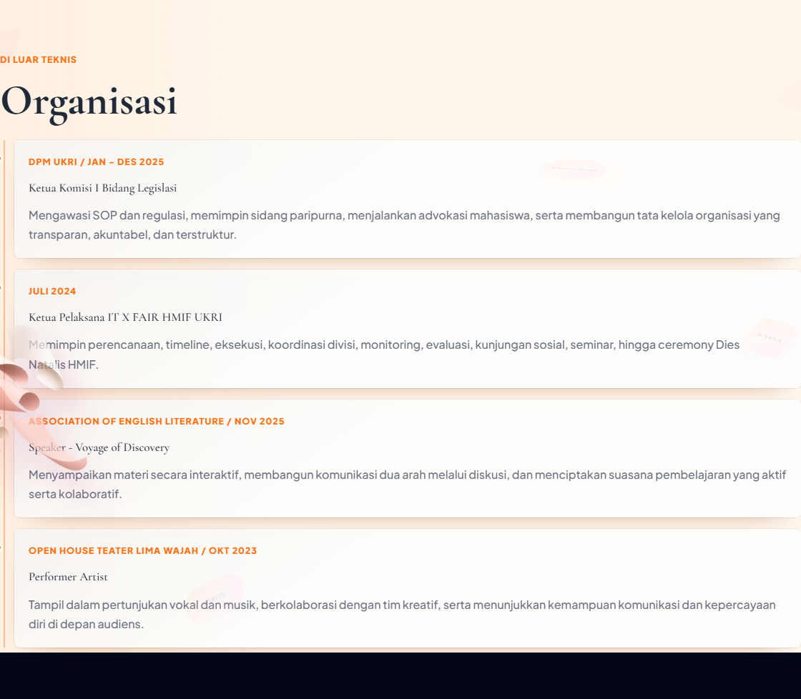

### 5. Galeri

Section Galeri adalah carousel kegiatan dengan foto utama, caption, tombol navigasi, dan thumbnail track. Isinya memperlihatkan panggung kepemimpinan, tim organisasi, public speaking, kegiatan kampus, kunjungan komunitas, rapat organisasi, dan presentasi akademik.

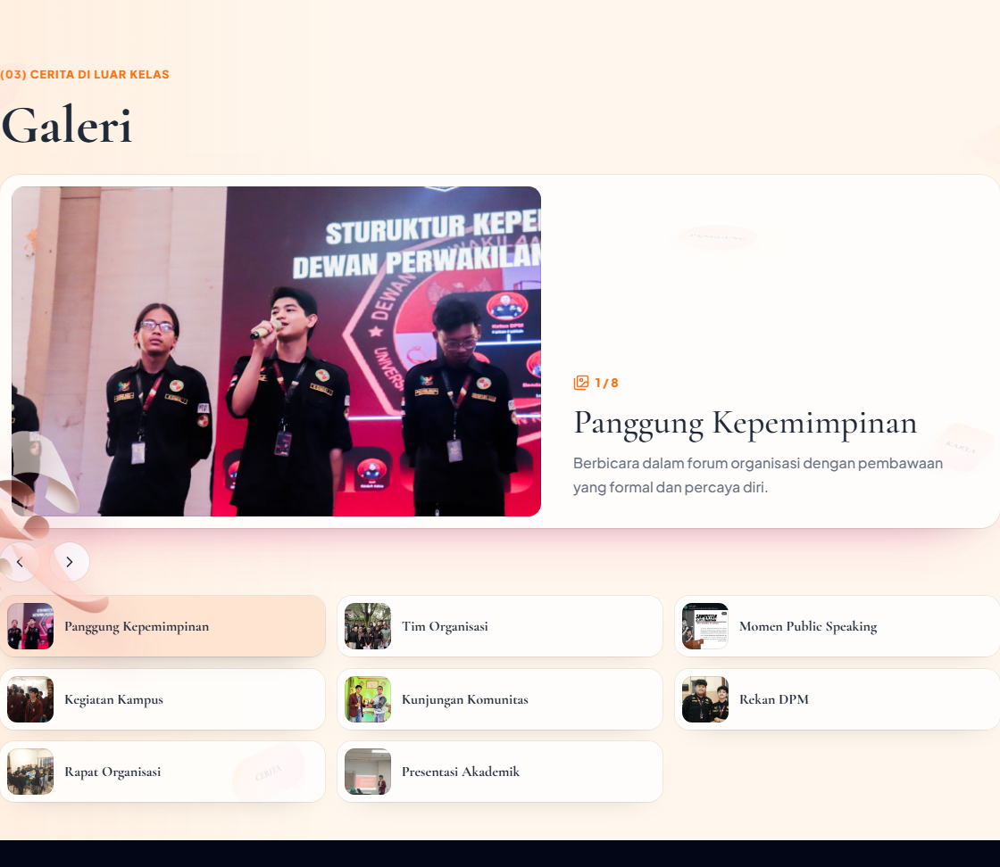

### 6. Sertifikat Casual

Sertifikat Casual berfokus pada bukti kegiatan non-teknis seperti BOMS Speaker, OMBAK 2022, webinar humas, dan IT Learn 2022.

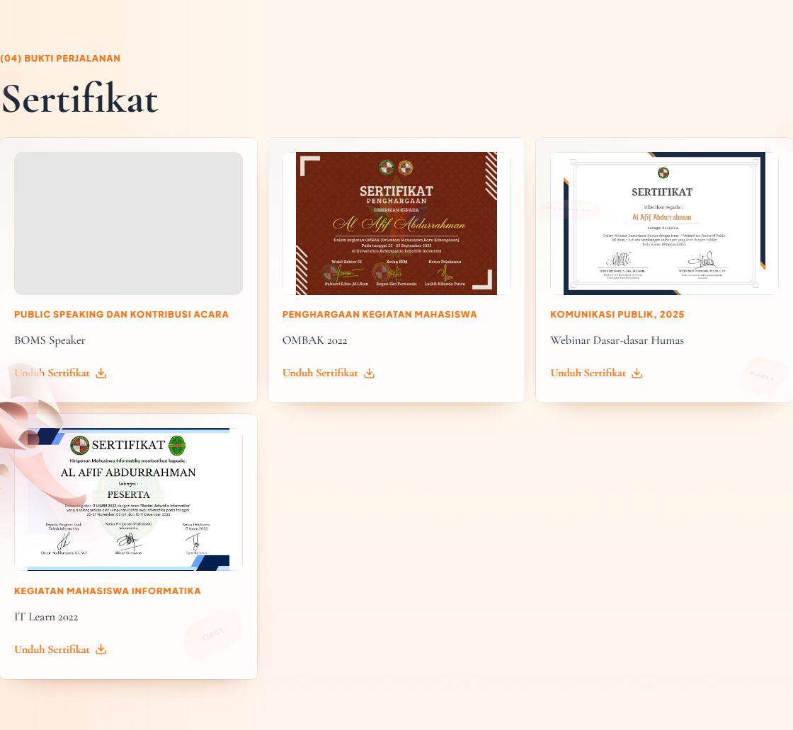

### 7. Kontak Casual

Kontak tetap tersedia pada mode Casual dengan channel yang sama: Email, LinkedIn, GitHub, dan WhatsApp.

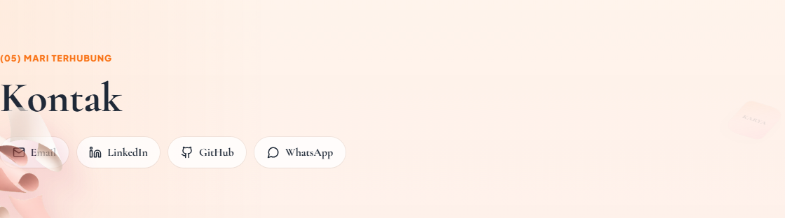

### 8. Footer Casual

Footer Casual mempertahankan CTA unduh CV, ringkasan narasi organisasi dan kepemimpinan, serta tombol untuk kembali ke mode Profesional.

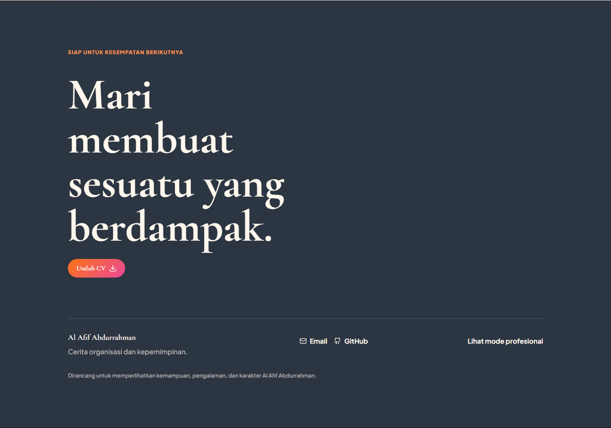

## Ringkasan Navigasi

- Mode Profesional: Beranda, Tentang, Skill, Project, Pengalaman, Pendidikan, Sertifikat, Kontak.
- Mode Casual: Beranda, Tentang, Organisasi, Galeri, Sertifikat, Kontak.

## Validasi Dokumentasi

Screenshot di README dihasilkan dari build production menggunakan Vite preview pada `http://127.0.0.1:5187`. Build production diverifikasi dengan:

```bash
cd frontend
npm run build
```
